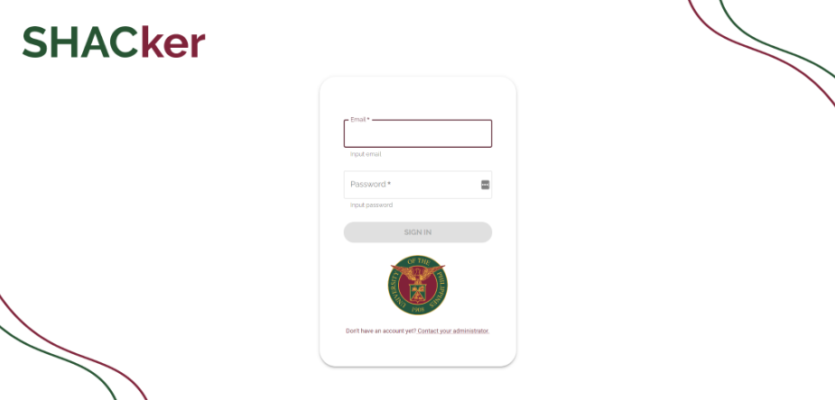
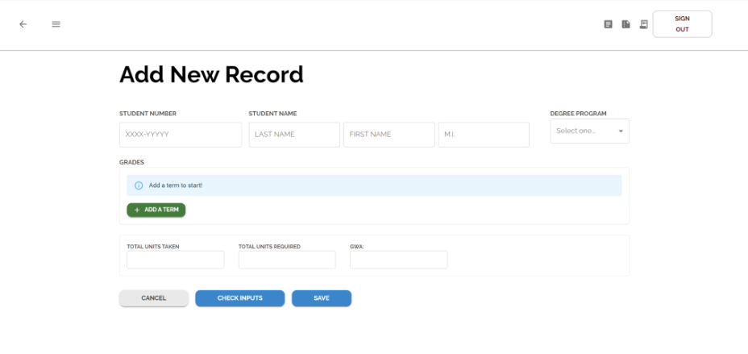
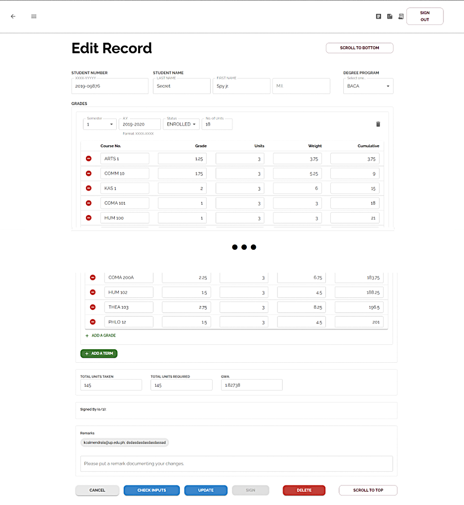
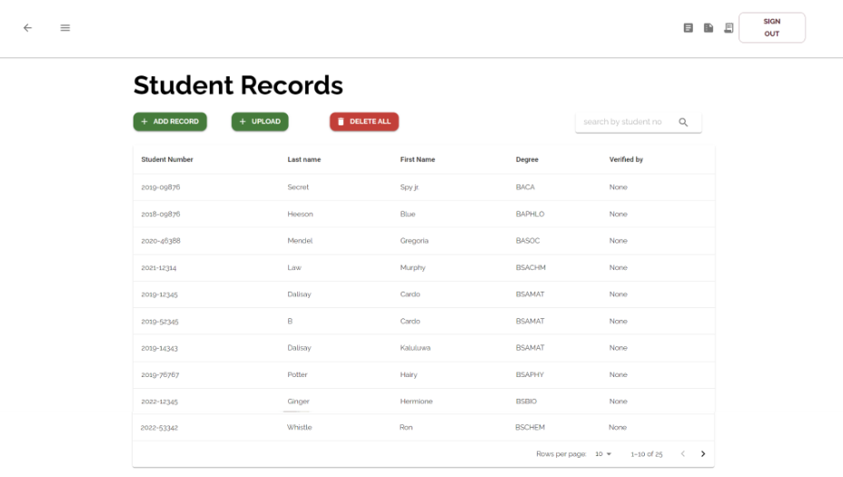
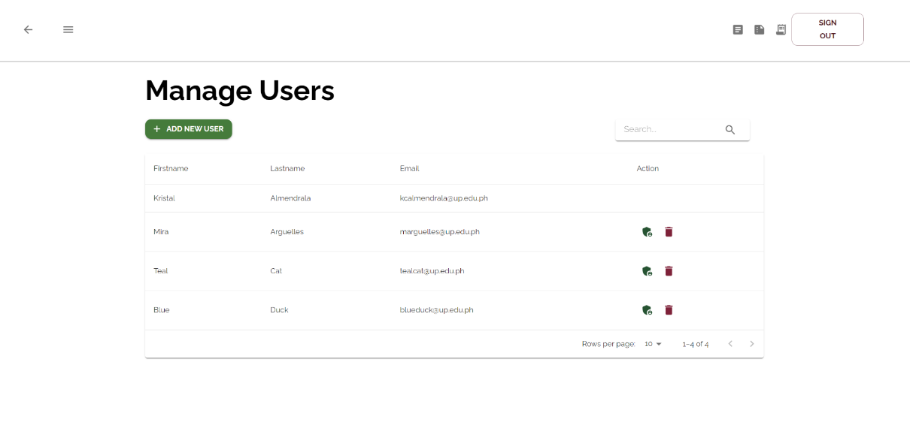
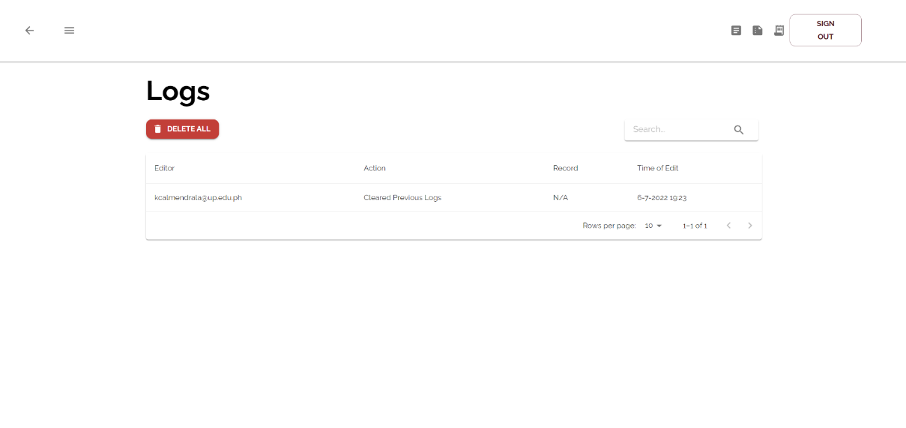

# SHACker: Student Record Verification System

## 📌 Overview

**SHACker** is a system intended for the College of Arts and Sciences (CAS) Scholarships, Honors, and Awards Committee (SHAC) to easily **examine records of graduating students** under the CAS degree
programs of the University of the Philippines - Los Baños (UPLB). The SHAC is responsible for verifying the completeness of units taken based on the majors specified in the degree program of a student record, its non-credit courses, electives, specialization courses, and General Education (GE) subjects. The committee also checks the correctness of grades, grade point calculations, and the summation of these grade points for the computation of the General Weighted Average (GWA). Along with more complex processes involved in verifying a student's graduation status, these are checked manually for each candidate student for graduation.

Through SHACker, the committee can easily detect **inconsistencies** in the student records which speeds up the process and ensures data integrity. Since computations, curriculum, and enrollment status checking from the student record are automated, the SHAC may focus more on cross-validating other supporting documents such as the Underload Permit, Replacement of GE courses form (i.e.,
CAS OCS Form 014) and GE Plan of Study (i.e., CAS OCS Form 019), among many others.

  

---

## 🛠️ Key Features & Services

* **Student Record Management:** Tools to **add, manage, and delete** csv and xlsx student records.
* **Record Verification:** Automatically flags **formatting, computational, and curriculum-based errors** and a system to let personnel digitally verify records.
* **System Monitoring:** Automatically tracks and logs **system activity** in reverse chronological order, documenting the user's email, the record accessed, the action taken, and the timestamp.

---

## 📂 Project Resources & Media

* 📄 **[Read the System Requirements Specifications Here](https://cmpascua.github.io/SHACker/Assets/SRS_SHACker_D4L.pdf)**

### 📺 Screenshots

Below are some screenshots of the core services of the SHACker web application:
  
* **Login Page**
  

* **Add Record Page**
  

* **Edit Record Page**
  

* **View Student Records Page**
  

* **Manage Users Page**
  

* **View Logs Page**
  
---

## 🖥️ Installation

### Method 1
> 1. Clone the repository.
> 2. Run the appropriate installer for your OS.

### Method 2
> 1. Clone the repository.
> 2. Enter `npm run shacker-install` on your terminal

### Method 3 (Recommended)

> 1. Clone the repository.
> 2. In *API/*, `npm i`
> 3. In *frontend/*, `npm i` (If it does not work, `npm i --force`)
> 4. In *frontend/server*, `npm i`
---

## 🧩 Running the App

>1. Go to *API/* then run `npm start`
>2. Then, using another terminal, go to *frontend/* and run`npm start`
>3. Enter the server's IP address (this was printed when you started the API) in your devices' address bars using port 5000. Format: <IP_ADDRESS>:5000
>4. Repeat Step 3 with other devices from the same network.
